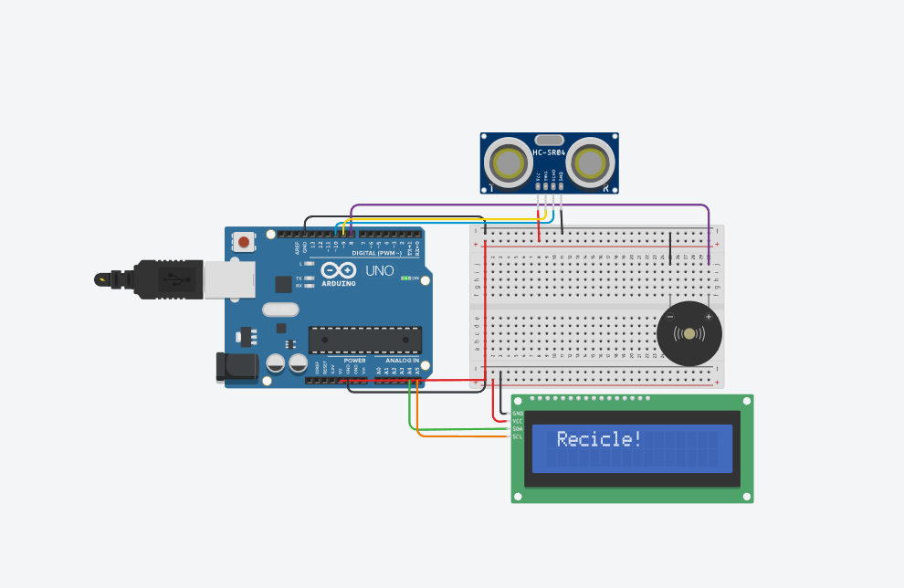

  

# ♻️ ReUse – Todo fim pode ser um recomeço  

O **ReUse** foi desenvolvido como parte do **desafio Learning Sectors**, etapa *Aprendendo como um Profissional da F1*.  
Nosso objetivo é transformar a experiência de reciclagem no ambiente escolar em algo **lúdico, interativo e sustentável**.  

O Learning Sectors é um desafio de pensamento computacional que busca inspirar a próxima geração
por meio da educação **STEM (Ciência, Tecnologia, Engenharia e Matemática)**. Uma iniciativa da
**Associação Conselho Britânico (British Council)**, a agência do Reino Unido para relações culturais e
educacionais.

A proposta não é criar uma nova lixeira, mas sim um **dispositivo tecnológico adaptável a qualquer lixeira já existente**, trazendo viabilidade econômica e sustentabilidade.  

---

## Apresentação

- [Vídeo de apresentação](https://youtu.be/ZzALCya8UUk)  
- [Relatório + Diário de Bordo](https://drive.google.com/file/d/10P9itkvRLbsPI6Mgf2X88jo6WqJEJkDL/view?usp=sharing)  

---

## Como funciona?

  

O dispositivo é composto por componentes simples e acessíveis, integrados por meio de uma placa **Arduino Uno**:  

- **Buzzer** → emite sons interativos após o descarte.  
- **Display LCD** → exibe mensagens divertidas e educativas.  
- **Sensor ultrassônico** → detecta o material descartado e identifica quando a lixeira está cheia.  
- **Protoboard e jumpers** → conexão entre os componentes.  

Assim, cada descarte torna-se uma experiência positiva e interativa, estimulando os alunos a reciclar.  
Além disso, o **efeito sonoro** também auxilia pessoas com deficiência visual a confirmar o descarte correto.  

---

## Nossa Equipe: F-Oners

- Cristiano Secco Júnior  
- Paulo Eduardo Ferreira Junior  
- Vicente Matheus Collin Pedroso  

---

## Objetivo

Promover a **conscientização ambiental** e incentivar a **reciclagem nas escolas** de forma criativa, mostrando como a tecnologia pode ser usada para resolver problemas reais de sustentabilidade.  

---

## Status

✅ Protótipo desenvolvido e validado com testes reais de usuários.  

---

## Conclusão
As atividades envolveram a construção e aprimoramento de protótipos funcionais, utilizando práticas de
inovação, testagem contínua e coleta de feedback para impacto positivo na comunidade escolar.
Foram desenvolvidas competências alinhadas à Base Nacional Comum Curricular (BNCC), com ênfase em:
- Competência Geral 5: Cultura digital;
- Competência Geral 10: Responsabilidade e cidadania.

O **ReUse** conecta tecnologia, sustentabilidade e educação, provando que **todo fim pode ser um recomeço**.  

---
